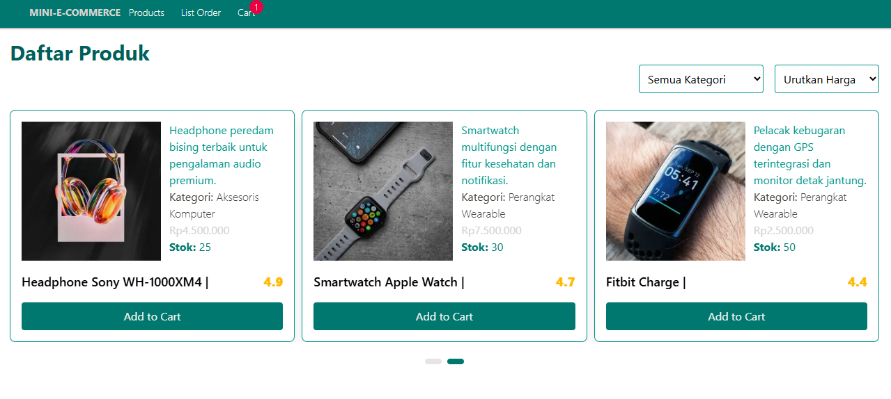

# Mini E-Commerce v0.1.0 (Frontend)

 <!-- Jika ada screenshot -->

Sebuah aplikasi mini e-commerce sederhana yang dibangun dengan Next.js dan React. Aplikasi ini menyediakan fungsionalitas dasar untuk menampilkan produk, mengelola keranjang belanja, dan proses checkout.

## Fitur Utama

- ✅ Menampilkan daftar produk
- ✅ Menambahkan produk ke keranjang belanja
- ✅ Mengatur jumlah (kuantitas) produk di keranjang
- ✅ Menghapus produk dari keranjang
- ✅ Proses checkout (menyimpan data ke database PostgreSQL)
- ✅ Menampilkan daftar order/pesanan

## ✅ Sudah Implementasi

- **Produk**
  - Menampilkan daftar produk dengan grid layout
  - Filter berdasarkan kategori (dropdown/button)
  - Filter berdasarkan harga (rentang harga/sort ascending/descending)
  - Paginasi produk
- **Keranjang Belanja**
  - Menambahkan/mengurangi jumlah produk
  - Menghapus produk dari keranjang
  - Menghitung total harga otomatis
- **Checkout**
  - Guest checkout dengan form sederhana
  - Penyimpanan pesanan ke database PostgreSQL
  - Tampilan konfirmasi order
- **Order Management**
  - Halaman daftar pesanan
  - Detail pesanan

### 🚧 Dalam Pengembangan

- Autentikasi pengguna
- Sistem pembayaran terintegrasi
- Review produk
- Pencarian produk
- fitur checkout form sederhana untuk guest checkout

## Tech Stack

Berikut adalah teknologi yang digunakan beserta kegunaannya dalam aplikasi ini:

| Teknologi                                                                                                                                           | Kegunaan                                                       |
| --------------------------------------------------------------------------------------------------------------------------------------------------- | -------------------------------------------------------------- |
|  **Next.js**                      | Framework React untuk server-side rendering dan routing        |
|  **React 19**                       | Library JavaScript untuk membangun UI                          |
|  **TailwindCSS** | Utility-first CSS framework untuk styling                      |
|  **Axios**                      | HTTP client untuk berkomunikasi dengan backend API             |
|  **Day.js**                                                                     | Library untuk memanipulasi dan menampilkan tanggal/waktu       |
|  **Lodash**                       | Utility library untuk operasi array, object, dll               |
|  **Swiper**                | Library untuk carousel/slider interaktif                       |
|  **Zustand**                                                           | State management untuk mengelola state aplikasi (seperti cart) |
|  **TypeScript**           | Superset JavaScript untuk type-checking                        |

## Struktur Folder

Berikut penjelasan struktur folder dan file penting dalam proyek:

```
├── next/ ------------------------ # Folder build Next.js
├── node_modules/ ---------------- # Dependencies proyek
├── public/ ---------------------- # Aset statis
│ └── assets/ -------------------- # Gambar dan aset visual
│ │
│ └── ... # 7 gambar lainnya
├── src/
│ ├── app/ ----------------- # Routing dan layout utama
│ │ ├── cart/ -------------- # Halaman keranjang belanja
│ │ │ └── page.tsx --------- # Komponen halaman cart
│ │ ├── orders/ ------------ # Halaman daftar pesanan
│ │ │ └── page.tsx --------- # Komponen halaman orders
│ │ ├── global.css --------- # Global styles
│ │ ├── layout.tsx --------- # Layout utama aplikasi
│ │ └── page.tsx ----------- # Halaman beranda (daftar produk)
│ ├── components/ ---------- # Komponen reusable
│ │ ├── Navbar.tsx --------- # Navigasi atas
│ │ └── ProductCard.tsx ---- # Komponen card produk
│ ├── data/ ---------------- # Data dummy/stub
│ │ └── products.ts -------- # Data produk dummy
│ ├── service/ ------------- # Service/API calls
│ │ └── orderServices.ts --- # Service untuk order (CRUD)
│ ├── store/ --------------- # State management
│ │ └── cartStore.ts ------- # Zustand store untuk keranjang
│ └── types/ --------------- # Type definitions
│ └── order.ts ------------- # Interface/Tipe untuk Order
├── .gitignore ---------- # File yang diignore oleh Git
├── eslint.config.mjs --- # Konfigurasi ESLint
├── next-env.d.ts ------- # Deklarasi tipe Next.js
├── next.config.ts ------ # Konfigurasi Next.js
├── package-lock.json --- # Lock dependencies
├── package.json -------- # Dependencies dan scripts
├── postcss.config.mjs -- # Konfigurasi PostCSS
├── README.md ----------- # File ini
└── tsconfig.json ------- # Konfigurasi TypeScript
```

### Type Safety

```typescript
export interface OrderItem {
  product_id: number;
  product: {
    id: number;
    nama: string;
    image: string;
    price: number;
  };
  quantity: number;
  price: number;
}
```

### State Management

    Zustand store untuk keranjang belanja:

    export const useCartStore = create<CartState>((set, get) => ({
    addToCart: (product) => {
        const existingItem = get().items.find((item) => item.id === product.id);
        if (existingItem) {
            set({
                items: get().items.map((item) => (item.id === product.id ? { ...item, qty: item.qty + 1 } : item)),
            });
        } else {
            set({
                items: [...get().items, { ...product, qty: 1 }],
            });
        }
    },
    })

Optimasi Performa

- Lazy loading gambar dengan next/image
- Memoization untuk komponen produk
- Debouncing untuk input filter (300ms)
- Code splitting untuk route halaman

# Dokumentasi Pengembangan

## Cara Menjalankan

1. Clone repositori:
   ```bash
   git clone [https://github.com/tkarombang/fe-mini-ecommerce]
   cd mini-ecommerce
   ```
2. Install dependencies:
   ```bash
   npm install
   ```
3. Produk akan otomatis muncul di halaman utama
   <strong>Tambahkan data produk atau kemungkinan data sudah ada di:</strong> src/data/products.ts:

   ```json
   {
     "id": 1,
     "nama": "Laptop ASUS ROG",
     "price": 15999222,
     "deskripsi": "Laptop gaming dengan performa tinggi",
     "kategori": "Elektronik",
     "stok": 10,
     "rating": 4.5,
     "image": "/assets/laptop-asus-rog.jpg"
   }
   ```

4. Jalankan Development Server
   ```bash
   npm run dev
   ```
5. Buka http://localhost:3000 di browser Anda

6. Implementasi Filter
   - Filter produk menggunakan query parameters: <strong> coming soon
   - Saat ini masih menggunakan fungsi di frontend</strong>
7. Proses Checkout | Flow
   - Data keranjang dari Zustand Store
   - Form validasi dengan react-hook-form <strong>coming soon</strong> saat ini masih menggunakan tombol Add to Cart
   - Simpan ke database PostgreSQL dengan Tombol Checkout Process
   ```
   {
       "items": [
           {
           "product_id": 0,
           "quantity": 0,
           "price": 0
           }
       ]
   }
   ```
8. Tampilkan Halaman konfirmasi <strong> Coming Soon</strong>

## Roadmap & Fitur yang Akan Datang

    Autentikasi pengguna

    Sistem pembayaran integrasi

    Review produk

    Kategori produk

    Pencarian produk

    Filter produk

## Kontribusi

Pull request dipersilakan. Untuk perubahan besar, buka issue terlebih dahulu untuk mendiskusikan apa yang ingin Anda ubah.

```bash
Catatan:
Aplikasi ini masih dalam pengembangan aktif (versi 0.1.0) dan mungkin terdapat bug atau fitur yang belum lengkap.
```
